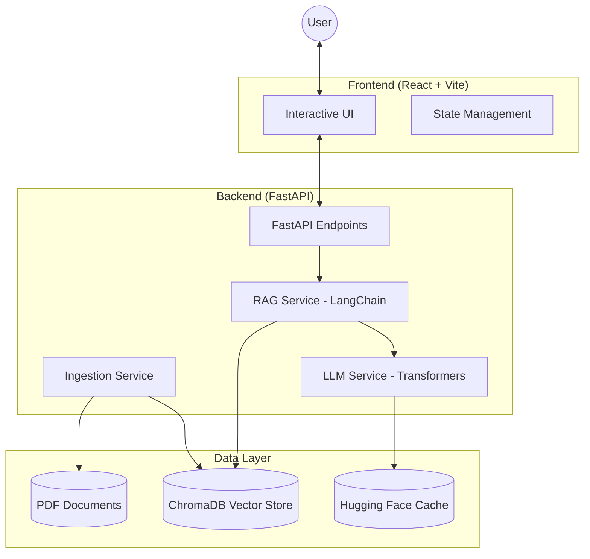

# Technical Architecture Overview

The Medical Assistant RAG (Retrieval-Augmented Generation) system is built as a decoupled full-stack application designed to provide evidence-based answers from medical documents.

## System Diagram

## Component Breakdown

### 1. Frontend (React)
- **Framework**: React 18 with Vite and TypeScript.
- **Styling**: Vanilla CSS with Framer Motion for smooth UI transitions.
- **Role**: Provides the chat interface, handles user queries, and displays retrieved source documents alongside AI-generated answers.

### 2. Backend (FastAPI)
- **API Layer**: [src/med_assistant/api/main.py](file:///c:/Users/91811/Desktop/Medical-Assistant-using-RAG/src/med_assistant/api/main.py) handles HTTP requests.
- **RAG Orchestration**: [src/med_assistant/services/rag_service.py](file:///c:/Users/91811/Desktop/Medical-Assistant-using-RAG/src/med_assistant/services/rag_service.py) uses **LangChain** to connect the retriever (ChromaDB) with the generator (LLM).
- **LLM Management**: [src/med_assistant/services/llm_service.py](file:///c:/Users/91811/Desktop/Medical-Assistant-using-RAG/src/med_assistant/services/llm_service.py) dynamically loads models based on hardware.
    - **GPU**: Uses `Meta-Llama-3-8B-Chat` with 4-bit quantization (bitsandbytes).
    - **CPU**: Falls back to `TinyLlama-1.1B` for lower-resource environments.
- **Data Ingestion**: [src/med_assistant/services/ingestion_service.py](file:///c:/Users/91811/Desktop/Medical-Assistant-using-RAG/src/med_assistant/services/ingestion_service.py) parses PDFs using `pypdf`, splits text into chunks, and populates the vector store.

### 3. Data Storage
- **Vector Database**: **ChromaDB** stores high-dimensional embeddings of the medical text chunks.
- **Embeddings**: Uses `sentence-transformers/all-mpnet-base-v2` for high-quality semantic search.

## Data Flow (Query Path)
1. **User** submits a question via the **Frontend**.
2. **FastAPI** receives the request and triggers the **RAG Service**.
3. The system converts the query into an embedding and performs a **similarity search** in **ChromaDB**.
4. The top $k$ relevant document chunks are retrieved.
5. A **Prompt** is constructed combining the retrieved context and the original question.
6. The **LLM** generates a response based *strictly* on that context.
7. The answer and references are returned to the user.
