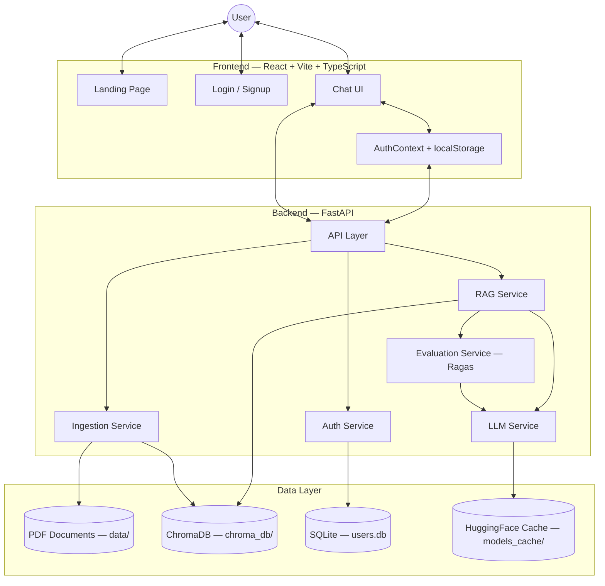
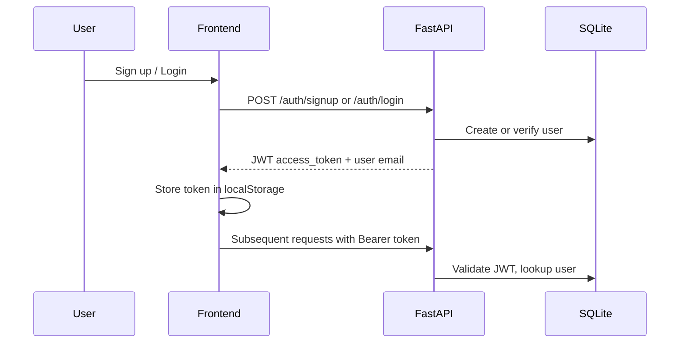
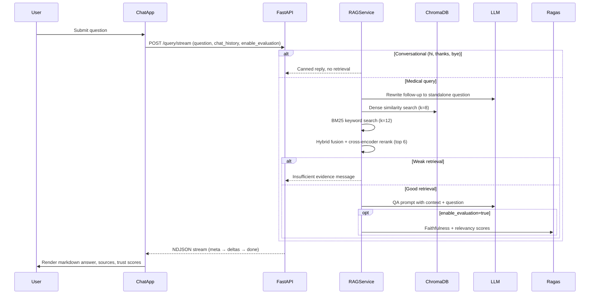
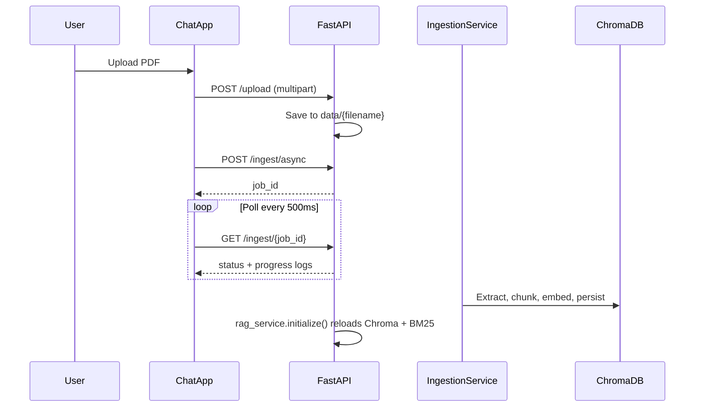

# Technical Architecture Overview

The Medical Assistant RAG (Retrieval-Augmented Generation) system is a decoupled full-stack application that lets authenticated users upload medical PDFs, index them into a vector store, and ask evidence-grounded questions with cited source documents.

---

## System Diagram



---

## Project Structure

```
med_assistant_rag/
├── src/med_assistant/          # Python backend package
│   ├── api/                    # HTTP layer (main.py, auth.py, deps.py)
│   ├── core/                   # Settings (config.py)
│   ├── db/                     # SQLAlchemy engine (database.py)
│   ├── models/                 # Pydantic schemas + SQLAlchemy User model
│   └── services/               # RAG, LLM, ingestion, evaluation, auth
├── frontend/                   # React SPA (Vite + TypeScript)
├── tests/                      # Pytest suite (API, auth, RAG, ingestion)
├── pyproject.toml              # Python dependencies (managed with uv)
├── uv.lock                     # Locked dependency versions
└── README.md                   # Setup and run instructions
```

**Runtime directories** (created at startup, gitignored):

| Path | Purpose |
|------|---------|
| `data/` | Uploaded and ingested PDF source files |
| `chroma_db/` | ChromaDB vector store persistence |
| `models_cache/` | HuggingFace model and embedding weights |
| `users.db` | SQLite database for user accounts |

---

## Component Breakdown

### 1. Frontend (React)

| Aspect | Detail |
|--------|--------|
| **Framework** | React 19 with Vite 8 and TypeScript |
| **Routing** | `react-router-dom` — `/`, `/login`, `/signup`, `/chat` |
| **Styling** | Vanilla CSS with Framer Motion animations |
| **Icons** | Lucide React |
| **Markdown** | `react-markdown` + `remark-gfm` for rendered answers |
| **State** | `AuthContext` for JWT session; local React state for chat; `localStorage` for conversations and preferences |

**Key components:**

| Component | File | Role |
|-----------|------|------|
| Landing page | `frontend/src/components/LandingPage.tsx` | Public marketing page |
| Login / Signup | `frontend/src/components/LoginPage.tsx`, `SignupPage.tsx` | Authentication forms |
| Protected route | `frontend/src/components/ProtectedRoute.tsx` | Redirects unauthenticated users to `/login` |
| Chat app | `frontend/src/App.tsx` | Full chat UI — sidebar, conversations, upload, streaming |
| API client | `frontend/src/api.ts` | HTTP calls to backend (auth, query stream, ingest, health) |
| Auth context | `frontend/src/context/AuthContext.tsx` | JWT token + email persistence and session verification |

**Routes:**

| Route | Access |
|-------|--------|
| `/` | Public |
| `/login`, `/signup` | Public |
| `/chat` | Authenticated only (wrapped in `ProtectedRoute`) |

---

### 2. Backend (FastAPI)

**Entry point:** `src/med_assistant/api/main.py`  
**Run command:** `uv run uvicorn med_assistant.api.main:app --host 0.0.0.0 --port 8000`

On startup the app initializes SQLite (`init_db()`) and loads the LLM plus ChromaDB via `RAGService.initialize()`.

#### API Routes

**RAG and document routes** (`main.py`):

| Method | Path | Auth | Description |
|--------|------|------|-------------|
| `GET` | `/health` | No | Readiness check + `evaluation_available` flag |
| `POST` | `/query` | JWT | Synchronous RAG query |
| `POST` | `/query/stream` | JWT | NDJSON streaming answer |
| `POST` | `/ingest` | JWT | Sync streaming ingestion (text/plain progress) |
| `POST` | `/ingest/async` | JWT | Background ingestion job; returns `job_id` |
| `GET` | `/ingest/{job_id}` | JWT | Poll ingestion job status and logs |
| `POST` | `/upload` | JWT | Upload PDF to `data/` |

**Auth routes** (`src/med_assistant/api/auth.py`, prefix `/auth`):

| Method | Path | Description |
|--------|------|-------------|
| `POST` | `/auth/signup` | Register user, return JWT |
| `POST` | `/auth/login` | Authenticate, return JWT |
| `POST` | `/auth/logout` | Logout (token validated) |
| `GET` | `/auth/me` | Current user email |

**Auth dependency:** `src/med_assistant/api/deps.py` — Bearer JWT via `HTTPBearer`, resolves user from SQLite.

**CORS:** Allows `http://localhost:5173` (Vite dev server).

#### Services

| Service | File | Role |
|---------|------|------|
| **RAGService** | `src/med_assistant/services/rag_service.py` | Orchestrates retrieval, generation, caching, and optional evaluation |
| **LLM** | `src/med_assistant/services/llm_service.py` | Loads HuggingFace causal LM into a LangChain pipeline |
| **IngestionService** | `src/med_assistant/services/ingestion_service.py` | PDF → chunks → embeddings → ChromaDB |
| **EvaluatorService** | `src/med_assistant/services/evaluation_service.py` | Ragas faithfulness and answer relevancy scoring |
| **AuthService** | `src/med_assistant/services/auth_service.py` | bcrypt password hashing, JWT create/decode |

#### RAG Pipeline

The retrieval layer goes beyond a basic LangChain chain:

1. **Conversational bypass** — Greetings, thanks, and bye skip retrieval (`is_conversational_query()`)
2. **Question rewriting** — Follow-up questions are rewritten to standalone form using the LLM when `chat_history` is present
3. **Hybrid retrieval:**
   - **Dense:** ChromaDB similarity search (`RETRIEVE_K_DENSE=8`)
   - **Sparse:** BM25 keyword index built from persisted Chroma documents (`RETRIEVE_K_BM25=12`)
   - **Fusion:** Reciprocal rank fusion merges both result sets
4. **Reranking:** Cross-encoder `cross-encoder/ms-marco-MiniLM-L-6-v2` (GPU only, lazy-loaded)
5. **Relevance threshold:** If best dense distance exceeds `RETRIEVAL_MAX_DISTANCE` (0.9), returns an "insufficient evidence" answer
6. **Prompting:** Custom medical QA prompt (context-only, no hallucination) via LangChain `PromptTemplate`
7. **Caching:** In-memory answer and retrieval caches (max 256 entries, process-local)
8. **Optional evaluation:** Ragas metrics when `ENABLE_RAG_EVALUATION=true` and the client sends `enable_evaluation=true`

#### LLM Integration

| Environment | Model | Notes |
|-------------|-------|-------|
| **GPU** | `mistralai/Mistral-7B-Instruct-v0.2` | 4-bit NF4 quantization via `bitsandbytes` |
| **CPU** | `TinyLlama/TinyLlama-1.1B-Chat-v1.0` | Fallback for lower-resource environments |

- **Wrapper:** `langchain_huggingface.HuggingFacePipeline` around a HuggingFace `text-generation` pipeline
- **Cache dir:** `models_cache/` (`MODEL_CACHE_DIR`)
- **Generation params:** `max_new_tokens=256`, `do_sample=False`, `repetition_penalty=1.1`

#### Data Ingestion

`src/med_assistant/services/ingestion_service.py`:

1. Scan `data/*.pdf`
2. Extract text per page with `PyMuPDF`, normalize, inject heading markers
3. Split with `RecursiveCharacterTextSplitter` (chunk_size=1000, overlap=100)
4. Embed with `sentence-transformers/all-mpnet-base-v2`
5. Persist to ChromaDB at `chroma_db/`

After ingestion completes, `rag_service.initialize()` reloads Chroma and rebuilds the BM25 index.

---

### 3. Data Storage

| Store | Technology | Location | Used For |
|-------|------------|----------|----------|
| **Vector store** | ChromaDB | `chroma_db/` | Document chunk embeddings and metadata |
| **User accounts** | SQLite + SQLAlchemy | `users.db` | Email, hashed password, `created_at` |
| **Source documents** | Local filesystem | `data/*.pdf` | Raw uploaded PDFs |
| **Model weights** | HuggingFace cache | `models_cache/` | LLM, embeddings, reranker weights |
| **Ingestion jobs** | In-memory dict | `_ingest_jobs` in `main.py` | Async ingestion status (process-local) |
| **Answer/retrieval cache** | In-memory dict | `RAGService` instance | Query result caching (process-local) |
| **Chat history** | Browser `localStorage` | Client-side | Conversations, auth token, evaluation toggle |

**Embeddings model:** `sentence-transformers/all-mpnet-base-v2` via `HuggingFaceEmbeddings`.

**User model:** `src/med_assistant/models/user.py` — table `users` with `id`, `email`, `hashed_password`, `created_at`.

---

## Data Flow

### Authentication



### Query (Primary Path)



**Step-by-step:**

1. User submits a question via the chat UI.
2. FastAPI receives `POST /query/stream` with JWT authentication.
3. RAGService checks for conversational queries; if medical, rewrites follow-ups and retrieves context.
4. Dense (ChromaDB) and sparse (BM25) results are fused and reranked.
5. If retrieval confidence is too low, a refusal message is returned.
6. Otherwise a prompt is built from retrieved chunks and the LLM generates an answer.
7. Optional Ragas evaluation scores faithfulness and relevance.
8. The answer, source documents, and metrics stream back to the frontend as NDJSON.

### Document Ingestion



---

## Configuration

### Backend (`src/med_assistant/core/config.py`)

Loaded via `pydantic-settings` from an optional `.env` file:

| Variable | Default | Purpose |
|----------|---------|---------|
| `DATA_DIR` | `data` | PDF storage |
| `DB_DIR` | `chroma_db` | ChromaDB path |
| `MODEL_CACHE_DIR` | `models_cache` | HuggingFace model cache |
| `CHUNK_SIZE` | `1000` | Text chunk size |
| `CHUNK_OVERLAP` | `100` | Chunk overlap |
| `EMBEDDING_MODEL` | `sentence-transformers/all-mpnet-base-v2` | Embedding model |
| `GPU_MODEL_ID` | `mistralai/Mistral-7B-Instruct-v0.2` | GPU LLM |
| `CPU_MODEL_ID` | `TinyLlama/TinyLlama-1.1B-Chat-v1.0` | CPU LLM |
| `RETRIEVE_K_DENSE` | `8` | Dense retrieval count |
| `RETRIEVE_K_BM25` | `12` | BM25 retrieval count |
| `RERANK_TOP_N` | `6` | Post-rerank top documents |
| `RETRIEVAL_MAX_DISTANCE` | `0.9` | Relevance cutoff |
| `RERANKER_MODEL_ID` | `cross-encoder/ms-marco-MiniLM-L-6-v2` | Reranker |
| `ENABLE_RAG_EVALUATION` | `true` | Server-side Ragas master switch |
| `DATABASE_URL` | `sqlite:///.../users.db` | User database |
| `SECRET_KEY` | *(must change in production)* | JWT signing key |
| `JWT_ALGORITHM` | `HS256` | JWT algorithm |
| `ACCESS_TOKEN_EXPIRE_MINUTES` | `10080` (7 days) | Token TTL |

### Frontend

| Variable | Default | Purpose |
|----------|---------|---------|
| `VITE_API_URL` | `http://localhost:8000` | Backend API base URL |

---

## Key Dependencies

### Python (`pyproject.toml`)

| Category | Packages |
|----------|----------|
| **API** | `fastapi`, `uvicorn`, `python-multipart`, `pydantic`, `pydantic-settings` |
| **LLM / ML** | `torch`, `transformers`, `accelerate`, `einops`, `bitsandbytes`, `xformers` |
| **RAG** | `langchain`, `langchain-community`, `langchain-huggingface`, `langchain-chroma` |
| **Embeddings / retrieval** | `sentence-transformers`, `chromadb`, `rank-bm25` |
| **Documents** | `PyMuPDF` |
| **Evaluation** | `ragas`, `datasets` |
| **Auth / DB** | `sqlalchemy`, `bcrypt`, `python-jose[cryptography]`, `email-validator` |

**Package manager:** `uv` (`uv sync`, `uv run`)

### Frontend (`frontend/package.json`)

| Category | Packages |
|----------|----------|
| **Core** | `react`, `react-dom`, `react-router-dom` |
| **HTTP** | `axios` |
| **UI** | `framer-motion`, `lucide-react`, `react-markdown`, `remark-gfm` |
| **Build** | `vite`, `@vitejs/plugin-react`, `typescript` |

---

## Deployment

There is no Docker or container orchestration in this repository. The architecture is local-first.

### Local Development

1. `uv sync` — install Python dependencies
2. `huggingface-cli login` — authenticate for model downloads
3. Place PDFs in `data/`, run `uv run python -m med_assistant.services.ingestion_service`
4. **Terminal 1:** `uv run uvicorn med_assistant.api.main:app --host 0.0.0.0 --port 8000`
5. **Terminal 2:** `cd frontend && npm install && npm run dev` → `http://localhost:5173`

### Frontend Production (Vercel)

- `frontend/vercel.json` — Vite SPA with catch-all rewrite to `index.html`
- Backend is not configured for cloud deployment in this repo; it expects a locally running FastAPI server

### Testing

```bash
uv run pytest   # tests/ with mocked RAG service
```

---

## Key File Reference

| Component | Path |
|-----------|------|
| FastAPI app and routes | `src/med_assistant/api/main.py` |
| Auth routes | `src/med_assistant/api/auth.py` |
| JWT dependency | `src/med_assistant/api/deps.py` |
| Settings | `src/med_assistant/core/config.py` |
| RAG orchestration | `src/med_assistant/services/rag_service.py` |
| LLM loading | `src/med_assistant/services/llm_service.py` |
| PDF ingestion | `src/med_assistant/services/ingestion_service.py` |
| Ragas evaluation | `src/med_assistant/services/evaluation_service.py` |
| Auth logic | `src/med_assistant/services/auth_service.py` |
| SQLite setup | `src/med_assistant/db/database.py` |
| API schemas | `src/med_assistant/models/schemas.py` |
| React app and chat UI | `frontend/src/App.tsx` |
| API client | `frontend/src/api.ts` |
| Auth context | `frontend/src/context/AuthContext.tsx` |

---

## Architectural Notes

- **Process-local state:** Ingestion jobs, answer caches, and retrieval caches live in memory and are not shared across workers or restarts.
- **Auth boundary:** All RAG and document endpoints require a valid JWT; only `/health` is public.
- **Evaluation cost:** Ragas evaluation triggers multiple extra LLM calls per answer and is gated by both a server master switch and a per-request client flag.
